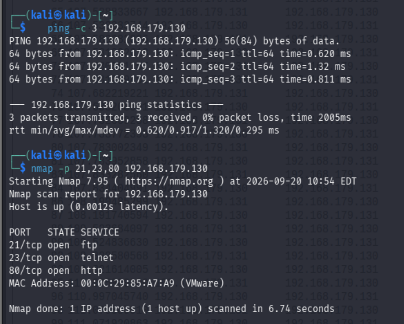
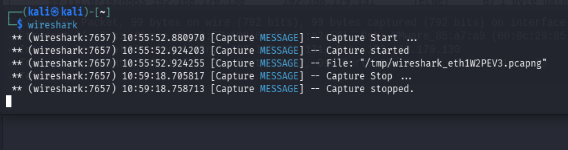
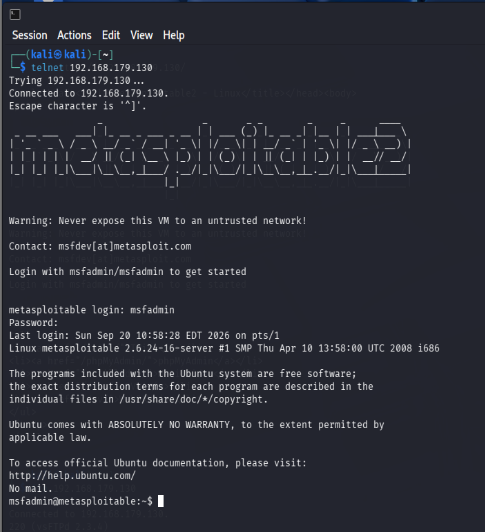

Experiment: Network Packet Capture and Analysis Using Wireshark

Aim

to capture and analyze network packets using wireshark and identify suspicious activity or cleartext credentials in a simulated network.

Requirements

kali linux, metasploitable 2, wireshark, vmware.

Procedure

(i) Start the metasploitable VM and note its IP address

→ 192.168.56.100

(ii) Verify connectivity from Kali

→ ping 192.168.56.100

(iii) start wireshark → sudo wireshark

(iv) select the network interface connected to the lab network and start capturing packets.

(v) Generate traffic → ping 192.168.56.100

(vi) Use wireshark filters to analyze traffic

→ ip.addr == 192.168.56.100

→ http

→ ftp

→ telnet

(vii) Inspect packet and use follow → TCP stream to examine communication.

(viii) For cleartext protocol analysis, connect to the lab FTP/Telnet service using test credentials and observe the captured packets.

Observations

(i) ICMP packets were observed during ping

(ii) TCP connections and the three way handshake were identified.

(iii) HTTP traffic could be inspected in plaintext

(iv) FTP/telnet traffic demonstrated the risk of transmitting data without encryption.

Result

The security risks associated with unencrypted protocols were demonstrated in the simulated lab environment.